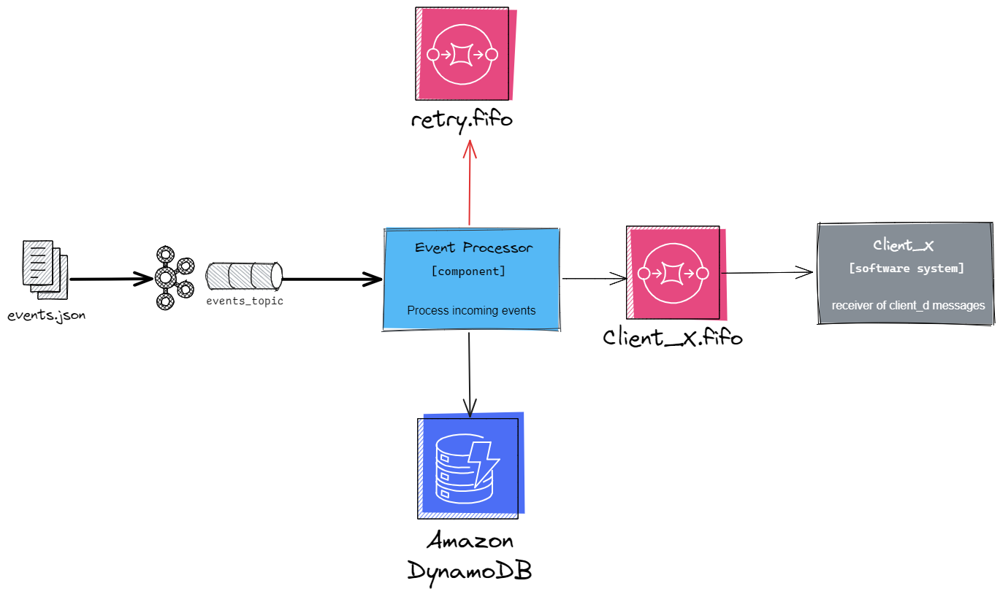
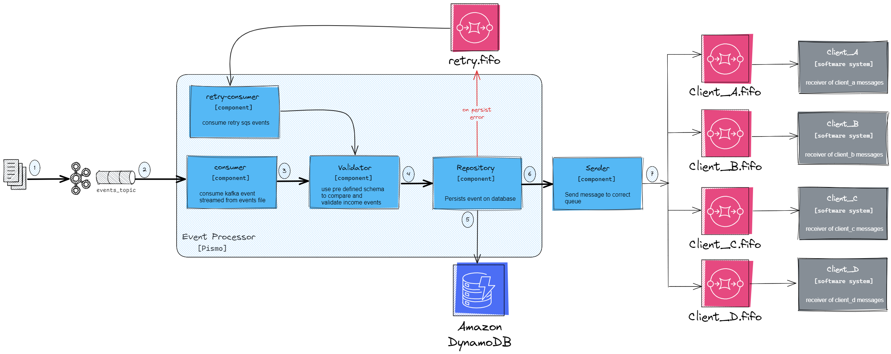
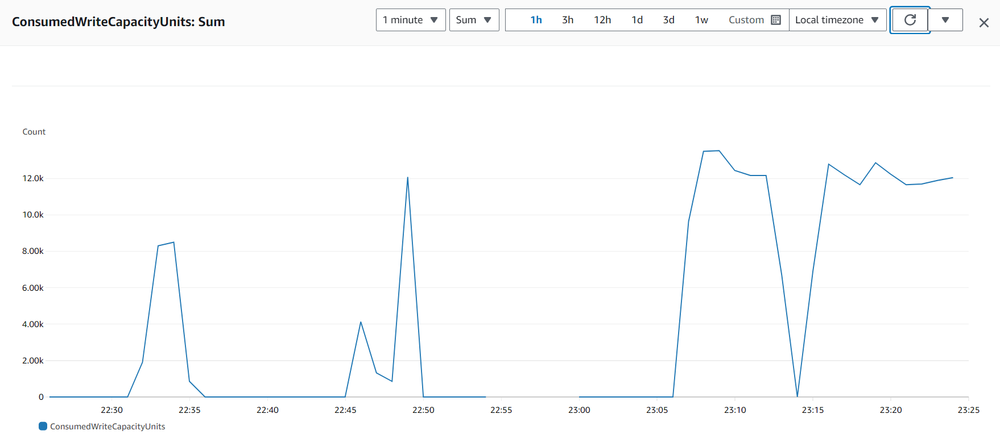
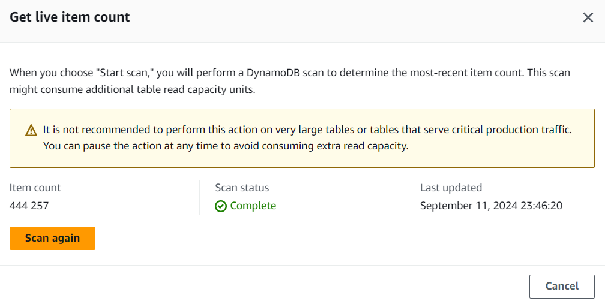
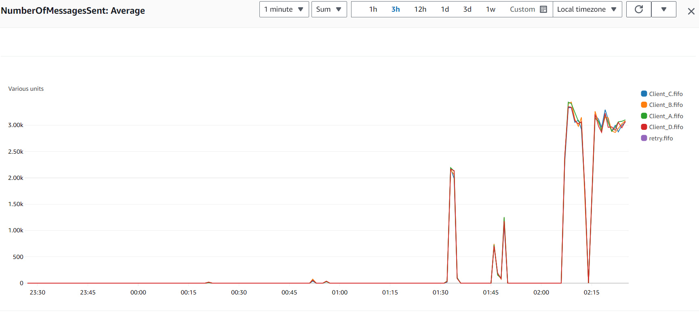

# Desafio Pismo

Desenvolver o Event Processor, que funcionará como um serviço reativo, sempre disponível, recebendo eventos de uma determinada fonte. Ele realizará o papel de validação, triagem e persistência, para que o evento esteja pronto para ser entregue para o cliente final por outro serviço posteriormente.

## Big Picture



A arquitetura selecionada para o desafio é uma proposta de arquitetura evolutiva, para uma Clean Architecture.	

### Componentes



1. Kafka connect stream file events to kafka;
2. Kafka get events and post on a topic;
3. Events are consumed by a kafka consumer in application;
4. After consume, we validate incoming message using ```schema.json```;
5. Data are persisted on a DynamoDB, on error we post on SQS topic;
6. Sender is responsible to route event to correct SQS queue using Client field to identify;


## Schema definido

type EventMessage struct {
	UID       string    `json:"uid"`
	Context   string    `json:"context"`
	EventType string    `json:"event_type"`
	Client    string    `json:"client"`
	CreatedAt time.Time `json:"created_at"`
}

Para os eventos foram criados os seguintes campos

* Context - indica o contexto do produtor
      
      "monitoramento", "aplicação de usuários", "autorizador de transações", "integrações"

* EventType - qual tipo do evento

      "INSERT", "UPDATE", "DELETE"

* Client - cliente o qual o evvento pertence 
	
		"Client_A", "Client_B", "Client_C", "Client_D"

## Executando aplicação

Ao executar a aplicação todos os registros no arquivo 
events.txt serão lidos pelo kafka connect, e enviados para um tópico que será consumido pela aplicação.

Para gerar novos eventos, pode utilizar a classe file_generator.go, ou então
colar os registros do arquivo events1.txt(um ou mais), no events.txt e serão processados real time.

### Subir o docker compose na raiz do projeto

```
docker-compose up -d
```

### Configurar Kafka Connect para ler arquivo

Use a API REST do Kafka Connect para criar o conector. Você pode fazer isso via curl ou algum cliente REST, por exemplo:

```
curl --location 'http://localhost:8083/connectors' \
--header 'Content-Type: application/json' \
--data '{
    "name": "file-source-connector",
    "config": {
        "connector.class": "FileStreamSource",
        "tasks.max": "1",
        "topic": "stream_producer",
        "file": "/data/events.txt",
        "value.converter": "org.apache.kafka.connect.storage.StringConverter",
        "key.converter": "org.apache.kafka.connect.storage.StringConverter"
    }
}'
```

verificar se esta rodando 
http://localhost:8083/connectors/file-source-connector/status

### No path pismo/cmd executar o comando

```
go run .
```
## Stream de dados

Foi gerado um arquivo txt, contendo os registros de eventos para simular nosso produtor, o código esta na classe ```./data/file_generator.go```

Utilizamos o ```confluentinc/cp-kafka-connect``` para realizar o stream dos dados do arquivo
para um tópico Kafka.

Os eventos chegam em um tópico do Kafka provisionado via docker ```confluentinc/cp-kafka```

* Aplicação retorna do ponto que parou

Caso a aplicação tenha algum problema, ocorra alguma falha a leitura do tópico 
será controlada pelo offset, garantindo que os eventos que já foram lidos não sejam lidos novamente.

## Consumer

Consumir o evento, é a primeira etapa do nosso caso de uso. Entâo foi registrado um consumer
utilizando go routines para tornar o processamento mais eficiente.

## Validator

Para validar o json foi utilizado a seguinte biblioteca 
```github.com/xeipuuv/gojsonschema```

na pasta encontrada na raiz *./resource* temos o arquivo ```schema.json```
contendo os campos esperados pelo evento recebido.

## Base de dados

Foi escolhido o DynamoDB para alto volume de requisições e escalabilidade horizontal, DynamoDB é geralmente mais adequado devido à sua capacidade de escalar automaticamente e oferecer baixa latência.

Para utilizar foi provisionado um serviço do DynamoDB na AWS, que estará disponivel para uso neste desafio.

### Template cloudformation da tabela

```
AWSTemplateFormatVersion: "2010-09-09"
Resources:
  EventMessageTable:
    Type: "AWS::DynamoDB::Table"
    Properties: 
      TableName: "pismo"
      AttributeDefinitions: 
        - AttributeName: "UUID"           # Defining the partition key
          AttributeType: "S"              # String type
      KeySchema: 
        - AttributeName: "UUID"
          KeyType: "HASH"                 # Partition key
      BillingMode: PAY_PER_REQUEST        # On-demand billing
      TimeToLiveSpecification:
        AttributeName: "ttl"              # Optional TTL attribute
        Enabled: false
      StreamSpecification:
        StreamViewType: NEW_AND_OLD_IMAGES  # Optional: enable DynamoDB Streams
      SSESpecification:
        SSEEnabled: true                  # Server-side encryption enabled
      Tags:
        - Key: "Environment"
          Value: "Production"
```
o qual poderá ser criado pelo console ou aws cli
```
aws cloudformation create-stack \
  --stack-name EventMessagesStack \
  --template-body file://path_to_your_template.yaml
```

## Sender 

### Template cloudformation das filas

```
AWSTemplateFormatVersion: "2010-09-09"
Resources:
  ClientAQueue:
    Type: "AWS::SQS::Queue"
    Properties: 
      QueueName: "Client_A.fifo"
      FifoQueue: true
      ContentBasedDeduplication: true
      Tags:
        - Key: "Client"
          Value: "Client_A"
        - Key: "Environment"
          Value: "Production"

  ClientBQueue:
    Type: "AWS::SQS::Queue"
    Properties: 
      QueueName: "Client_B.fifo"
      FifoQueue: true
      ContentBasedDeduplication: true
      Tags:
        - Key: "Client"
          Value: "Client_B"
        - Key: "Environment"
          Value: "Production"

  ClientCQueue:
    Type: "AWS::SQS::Queue"
    Properties: 
      QueueName: "Client_C.fifo"
      FifoQueue: true
      ContentBasedDeduplication: true
      Tags:
        - Key: "Client"
          Value: "Client_C"
        - Key: "Environment"
          Value: "Production"

  ClientDQueue:
    Type: "AWS::SQS::Queue"
    Properties: 
      QueueName: "Client_D.fifo"
      FifoQueue: true
      ContentBasedDeduplication: true
      Tags:
        - Key: "Client"
          Value: "Client_D"
        - Key: "Environment"
          Value: "Production"
```

## Retry

### Done

Utilizar o retry do kafka controlando a quantidade de retries com
```const maxRetries = 5```
Sempre que houver algum erro existe um loop que irá controlar as retentativas.

#### TODO

Para caso de falhas foi criada uma fila e um consumidor para retry, caso exista um erro durante a persistência, esse registro irá realizar uma retentativa.

utilizaremos o serviço de SQS, como mensageria para o nosso retry.

### Template cloudformation
```
AWSTemplateFormatVersion: "2010-09-09"
Resources:
  RetryQueue:
    Type: "AWS::SQS::Queue"
    Properties: 
      QueueName: "retry.fifo"
      FifoQueue: true
      ContentBasedDeduplication: true
      Tags:
        - Key: "Client"
          Value: "Retry"
        - Key: "Environment"
          Value: "Production"
```
O retry terá os seguintes aspectos

Persistência e Envio para SQS:
A função ProcessMessage valida e persiste o evento no DynamoDB e, em seguida, tenta enviar o evento para o SQS.

Retentativas:
Se a persistência ou o envio falharem, o sistema tenta reprocessar o evento até atingir um máximo de 5 tentativas, usando o campo RetryCount no EventMessage.

Backoff (Exponencial, opcional):
Você pode implementar um backoff exponencial (por exemplo, com time.Sleep) dentro da função retryOrDLQ para espaçar as tentativas.

Dead Letter Queue (DLQ):
Se o número máximo de tentativas for atingido, o evento pode ser enviado para uma DLQ para análise posterior.
Garantia de Confiabilidade:

Persistência de estado: O contador de retentativas (RetryCount) ajuda a garantir que o evento não será reprocessado infinitamente.

DLQ: Eventos que não podem ser processados após várias tentativas são enviados para a Dead Letter Queue para não serem perdidos.

Backoff Exponencial: Reduz a pressão no sistema em caso de falhas contínuas.

Essa abordagem garante que o sistema seja resiliente a falhas durante a persistência e o envio de mensagens para o SQS.

## Producer

Para produzir eventos pode se utilizar o KafaUI

Acessando pela URL
```
http://localhost:8080/
```
e depois acessando o tópico e produzindo uma mensagem de acordo com o schema definido

## Cobertura de testes

O foco dos testes, foram as funções que poderiam causar alguma anomalia
Funções construtoras, do tipo New... seriam testados em um novo momento.

Para algumas classes de integração com clients de banco de dados não foram criados testes nesse momento, pois
sâo interfaces com chamadas a libs externas já testadas.

## Monitoria e observabilidade

Poderiamos inserir métricas durante alguns momentos do fluxo da aplicação como

- Consumo de mensagens

- Validação de schema - alertas quando schema inválido

- Erros na persistencia

- Quantidade de retries, max reached

- Successo e Erros no envio para o SQS

## Teste de carga

O teste de carga foi realizado utilizando um arquivo contendo 2MI de registros. 

A performance pode ter sido afetada pela quantidade de logs presentes no fluxo. A partir de September 11, 2024 23:15:41, o log foi removido para comparação de resultados.

Resultados
* 23:15 = 80k
* 23:30 = 260k 
* 23:45 = 444k 

* CloudWatch DynamoDB


* Item count


* CloudWatch SQS


Dessa forma fomos capazes de importar 180k mensagens em um período de 15 minutos.
De forma que importariamos uma média de 720k/hora de eventos.

Para melhorar deveríamos variar, a quantidade de goroutines, evitar gravar evento por evento
e sim acumular em batches para persistencia.
E segregar de forma assincrona o envio para SQS.

## Melhorias

Como melhoria poderiamos utilizar um arqui

* Podemos utilizar o metodo de inserção em batch no DynamoDB, para acumular itens e fazer o insert para diminuir o io;

* Utilizar um serviço para armazenar o arquivo de configuração fora da aplicação

* Realizar o stream a partir de um S3 ou outras fontes

* Podemos adicionar segurança nas instancias limitando os IPs que podem acessar o serviço

* Remover variaveis hardcoded e colocar no arquivo de configuração ou inserir como constantes 